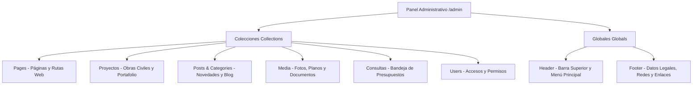

# 📘 Manual Tecnológico y Guía de Gestión de Contenido: Payload CMS
**Proyecto:** WebCastro — Construcciones Los Castros C.A.  
**Stack Tecnológico:** Next.js 15 (App Router) + Payload CMS v3 + PostgreSQL + Vercel Blob Storage  
**Fecha de Publicación:** Septiembre 2026  
**Autor:** Antigravity / ALFRED  

---

## 1. Introducción y Arquitectura de la Plataforma

El portal web de **Construcciones Los Castros C.A.** está construido bajo el paradigma moderno de **Headless CMS & Server-Driven UI**, combinando la robustez de **Next.js 15 (App Router)** con la flexibilidad de **Payload CMS v3**.

### ¿Qué significa esto para la gestión del contenido?
1. **Desacoplamiento Total:** La capa visual (diseño, tipografía, interactividad) y la capa de datos (textos, imágenes, proyectos, parámetros de contacto) están separadas.
2. **Autonomía Operativa:** Los administradores, redactores y directores pueden crear, modificar o reorganizar secciones completas de la web desde el panel administrativo (`/admin`) sin necesidad de tocar código ni requerir despliegues técnicos.
3. **Persistencia y Medios:** 
   - La base de datos relacional **PostgreSQL** almacena la estructura jerárquica de contenidos, relaciones y textos.
   - El almacenamiento de activos multimedia opera mediante **Vercel Blob Storage**, permitiendo que planos, fotos de obras y documentos se distribuyan a escala global mediante una CDN de alto rendimiento.

---

## 2. Mapa Conceptual: Colecciones vs. Globales

En Payload CMS existen dos grandes tipos de entidades para organizar la información:



### A. Colecciones (`Collections`)
Son listas dinámicas que contienen múltiples registros o documentos independientes:
- **`Pages` (Páginas):** Representa cada página navegable de la web. Cada página se compone de un título, una ruta única (`slug`) y una secuencia personalizada de bloques visuales.
- **`Proyectos` (Obras y Fichas Técnicas):** Catálogo especializado de obras civiles, geotecnia, pilotaje y proyectos petroleros ejecutados por la constructora.
- **`Posts` (Artículos de Noticias / Blog):** Entradas editoriales, memorias técnicas y comunicados de la empresa.
- **`Categories` (Categorías):** Taxonomía para clasificar las publicaciones del blog.
- **`Media` (Biblioteca Multimedia):** Imágenes, renders, planos en PDF e isotipos subidos al sistema.
- **`Consultas` (Bandeja de Contacto):** Registros automáticos generados cuando un cliente llena el formulario de contacto o solicitud de cotización en la web.
- **`Users` (Usuarios Administrativos):** Cuentas con credenciales para acceder y gestionar el panel de control.

### B. Globales (`Globals`)
Son elementos de configuración singleton (únicos en todo el sitio web):
- **`Header` (Encabezado):** 
  - *Barra Superior (Top Bar):* Teléfonos de contacto directo, horario de atención, dirección física y botón CTA de "Solicitar Cotización".
  - *Navegación:* Menú principal y enlaces de acceso directo.
- **`Footer` (Pie de Página):** 
  - Logotipo oficial, razón social (`Construcciones Los Castros C.A.`), descripción corporativa, enlaces a redes sociales (Facebook, Instagram, LinkedIn, etc.), columnas de navegación y créditos legales.

---

## 3. ¿Cómo Ubicar el Contenido en la Web?

### 3.1. Acceso al Panel de Control
Para gestionar el contenido, diríjase a la ruta administrativa en su navegador:
```text
https://[dominio-de-la-web]/admin
```
*(En entorno de desarrollo local: `http://localhost:3000/admin`)*

---

### 3.2. Mapa de Ubicación por Secciones

| Si desea modificar... | Diríjase en Payload a: | Detalle de ubicación |
| :--- | :--- | :--- |
| **La Página de Inicio (Home)** | `Colecciones` > `Pages` | Registro con `slug`: **`home`**. |
| **Páginas Internas** (Nosotros, Servicios, Contacto) | `Colecciones` > `Pages` | Busque el registro por su título o `slug` (ej. `/nosotros`, `/servicios`). |
| **Una Obra o Proyecto del Portafolio** | `Colecciones` > `Proyectos` | Seleccione el proyecto a editar (título, fotos, cliente, categoría). |
| **Una Noticia o Publicación del Blog** | `Colecciones` > `Posts` | Seleccione el post o cree uno nuevo vinculándolo a una categoría. |
| **Teléfonos, Dirección o Botón Superior** | `Globales` > `Header` | Pestaña *"Barra Superior (Top Bar)"*. |
| **Menú de Navegación Principal** | `Globales` > `Header` | Pestaña *"Navegación"*. |
| **Redes Sociales, Razón Social o Pie de Página** | `Globales` > `Footer` | Pestañas *"Marca y Redes"* y *"Columnas de Enlaces"*. |
| **Mensajes y Solicitudes de Cotización Recibidas** | `Colecciones` > `Consultas` | Bandeja de mensajes enviados por los visitantes desde la web. |
| **Subir o Reemplazar Fotografías** | `Colecciones` > `Media` | Repositorio central de archivos multimedia. |

---

## 4. ¿Cómo Crear Nuevo Contenido en la Web?

### 4.1. Creación de una Nueva Página Web (Paso a Paso)

Cada página web se ensambla como un conjunto de piezas modulares (bloques).

```text
[ Título de la Página ]  -->  "Nuestros Servicios de Geotecnia"
[ Slug (Ruta URL) ]      -->  "servicios-geotecnia" (URL final: tudominio.com/servicios-geotecnia)
[ Estructura de Bloques ]
    ├── 1. Bloque: Hero (Cabecera de impacto con foto y título)
    ├── 2. Bloque: AboutUs o Features (Descripción técnica de capacidades)
    ├── 3. Bloque: Services (Cuadrícula con fichas de cada servicio)
    ├── 4. Bloque: Projects (Muestra de obras asociadas a este servicio)
    └── 5. Bloque: CtaBanner (Llamado a solicitar cotización para este rubro)
```

#### Pasos en el Panel:
1. Vaya a **`Pages`** en el menú lateral y haga clic en **`Create New`** (Crear Nuevo).
2. **Título de la Página:** Escriba el nombre representativo (ej. *Ingeniería Geotécnica y Pilotaje*).
3. **Slug (en la barra lateral derecha):** Escriba la palabra o frase que definirá la URL en minúsculas y separada por guiones (ej. `geotecnia-pilotaje`).
   > **Nota importante:** El slug `'home'` está reservado exclusivamente para la página principal (`/`).
4. **Estructura de Bloques de la Página (`layout`):**
   - Haga clic en **`Add Block`** (Añadir Bloque).
   - Seleccione el bloque visual que necesita de la lista desplegable.
   - Complete los campos específicos de ese bloque (título, subtítulo, imágenes, listas).
   - Puede añadir tantos bloques como desee, arrastrarlos para cambiar el orden de aparición vertical o eliminarlos.
5. Haga clic en **`Save`** (Guardar) o **`Publish`** (Publicar).

---

### 4.2. Catálogo Completo de Bloques Disponibles

El motor `BlocksRenderer` de WebCastro cuenta con **19 bloques modulares prediseñados y adaptados a la identidad visual de la constructora**:

| Bloque (`blockType`) | Propósito y Uso Recomendado | Elementos Clave |
| :--- | :--- | :--- |
| **`Hero`** | Encabezado principal de la página. Impacto inicial con fotografía de gran escala. | Título principal, bajada explicativa, botones de llamada a la acción (CTA) y fondo multimedia. |
| **`AboutUs`** | Sección corporativa sobre la empresa. | Reseña institucional, años de experiencia, cifras clave y fotografía del equipo/obra. |
| **`Services`** | Malla de tarjetas de servicios de ingeniería y construcción. | Ícono/imagen, nombre del servicio, descripción resumida y enlace a detalle. |
| **`Process`** | Metodología de trabajo y fases operativas paso a paso. | Diagrama secuencial: Planificación, Topografía, Ejecución, Supervisión y Entrega. |
| **`Projects`** | Sección destacada de obras seleccionadas del portafolio. | Enlace dinámico con la colección de Proyectos para mostrar fichas interactivas. |
| **`PortfolioGrid`** | Cuadrícula completa de portafolio con filtros interactivos. | Visualización en mosaico filtrable por categorías (vialidad, petróleo, pilotaje, etc.). |
| **`Slider`** | Carrusel fotográfico dinámico de obras, maquinaria o procesos. | Deslizador horizontal de imágenes en alta definición con textos descriptivos. |
| **`Features`** | Cuadrícula de ventajas competitivas o capacidades técnicas. | Tarjetas con íconos resaltando maquinaria propia, solvencia técnica, certificaciones y seguridad. |
| **`MissionVision`** | Cuadros institucionales de Misión, Visión y Valores. | Bloques contrastados para la identidad estratégica de la constructora. |
| **`OrgChart`** | Organigrama funcional y directivo de la compañía. | Estructura jerárquica de gerencias (Operaciones, Proyectos, Geotecnia, Administración). |
| **`ClientLogos`** | Carrusel o grilla de logotipos de clientes institucionales. | Marcas de clientes y contratantes (empresas públicas, privadas, petroleras y ministerios). |
| **`Testimonials`** | Reseñas y recomendaciones de clientes y aliados. | Citas textuales, nombre del contratante, cargo e institución que certifica la obra. |
| **`Faq`** | Preguntas Frecuentes desplegables (Acordeón). | Respuestas a dudas habituales sobre cotizaciones, cobertura geográfica y plazos. |
| **`CtaBanner` / `Cta`** | Franja visual de alto impacto para incentivar el contacto. | Fondo contratado, texto contundente y botón directo hacia el WhatsApp o formulario. |
| **`Contact`** | Bloque integrado de contacto. | Formulario para que el cliente escriba, junto a mapa de ubicación y datos telefónicos. |
| **`PostsGrid`** | Grilla de artículos recientes de noticias o boletines técnicos. | Entradas recientes del blog con fecha, categoría e imagen destacada. |
| **`Column`** | Estructura flexible de columnas para contenido editorial mixto. | 2 o 3 columnas para combinar textos enriquecidos, viñetas y fotos secundarias. |
| **`LegalInfo`** | Ficha con información fiscal, jurídica y solvencias técnicas. | Razón social, RIF, clasificaciones del Registro Nacional de Contratistas (RNC), etc. |

---

### 4.3. Creación de un Nuevo Proyecto de Obra

Para alimentar el portafolio técnico de la empresa:

1. Ingrese a **`Proyectos`** > **`Create New`**.
2. Complete la ficha técnica:
   - **Título:** Nombre de la obra (ej. *Construcción de Pantallas Atirantadas y Drenajes - Tramo Autopista Regional del Centro*).
   - **Categoría:** Seleccione una de las especialidades oficiales:
     - `Vialidad`
     - `Petróleo & Gas`
     - `Pilotaje`
     - `Patrimonio`
     - `Ambiental`
   - **Imagen:** Seleccione o suba la fotografía principal de la obra (relación con la colección `Media`).
   - **Descripción:** Resumen del alcance de la obra, cubicación y retos superados.
   - **Tecnología / Especialidad:** Métodos y maquinaria empleada (ej. *Pilotes vaciados in situ, micropilotes autoperforantes, concreto proyectado*).
   - **Cliente:** Entidad contratante (ej. *Ministerio de Transporte / PDVSA / Empresa Privada*).
   - **Año:** Año de entrega (ej. *2024*).
3. Guarde el registro. El proyecto aparecerá automáticamente en las páginas que contengan los bloques `Projects` o `PortfolioGrid`.

---

### 4.4. Buenas Prácticas para la Subida de Medios (`Media`)

El sistema cuenta con el optimizador de imágenes **Sharp** y almacenamiento en la nube **Vercel Blob Storage**:
- **Formatos Recomendados:** `.webp` (preferido por velocidad y compresión), `.jpg` para fotografías de obra y `.png` o `.svg` para logotipos y planos con transparencia.
- **Resolución Óptima:**
  - Imágenes para Hero o Slider principal: entre **1920px y 2560px** de ancho.
  - Imágenes para tarjetas de servicios o proyectos: entre **800px y 1200px** de ancho.
- **Peso de Archivo:** Se recomienda que las fotos no superen los **2 MB** por archivo. El sistema generará automáticamente miniaturas optimizadas para dispositivos móviles.

---

## 5. Previsualización en Vivo y Ciclo de Publicación Inmediata

### 5.1. Live Preview (Previsualización en Pantalla Dividida)
Al editar cualquier página en `Pages`, dispone de la herramienta **Live Preview**. Esta función abre una vista interactiva de la web junto al formulario de edición con 3 resoluciones seleccionables:
- 📱 **Móvil:** 375 x 667 px
- 💻 **Tablet:** 768 x 1024 px
- 🖥️ **Escritorio:** 1440 x 900 px

Permite comprobar cómo se ajustan los bloques, títulos y botones antes de hacer pública la modificación.

### 5.2. Revalidación Instantánea (ISR - On-Demand Revalidation)
La plataforma no requiere reconstrucciones del sitio web (*builds*) para reflejar los cambios:
- Al guardar o actualizar una página, se ejecuta el hook interno `revalidatePage`.
- Al modificar el `Header` o `Footer`, se ejecutan `revalidateHeader` y `revalidateFooter`.
- La caché de Next.js se purga en milisegundos y los visitantes verán el contenido fresco al recargar su navegador.

---

## 6. Resumen de Flujo de Trabajo para el Gestor de Contenido

```text
                  ┌────────────────────────────────────────┐
                  │ 1. Identificar la necesidad de cambio  │
                  └───────────────────┬────────────────────┘
                                      │
               ┌──────────────────────┴──────────────────────┐
               ▼                                             ▼
    ¿Es una página o ruta?                        ¿Es un elemento global?
               │                                             │
    ┌──────────┴──────────┐                       ┌──────────┴──────────┐
    ▼                     ▼                       ▼                     ▼
Modificar existente   Crear nueva              Editar Header         Editar Footer
(`Pages` > Editar)    (`Pages` > Create New)   (Barra sup./Menú)     (Redes/Enlaces)
    │                     │                       │                     │
    └──────────┬──────────┘                       └──────────┬──────────┘
               │                                             │
               ▼                                             ▼
   Configurar Bloques en `layout`                 Guardar configuración
   (Hero, Services, Contact, etc.)                           │
               │                                             │
               ▼                                             │
      Verificar en Live Preview                              │
               │                                             │
               ▼                                             │
      Guardar / Publicar  ◄──────────────────────────────────┘
               │
               ▼
   Revalidación automática en Vercel -> Reflejo inmediato en la web pública
```

---
*Documento preparado como guía técnica y de gestión para Construcciones Los Castros C.A.*
